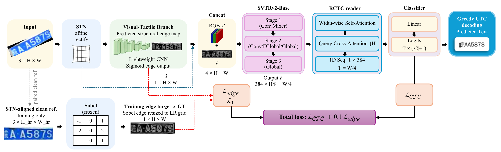

# LVT-EG: Edge-Guided License Plate Recognition via Learned Visual Tactility

[](pyproject.toml)
[](pyproject.toml)
[](pyproject.toml)

Reference implementation for **"LVT-EG: Edge-Guided License Plate Recognition via Learned Visual Tactility"**, accepted at the 9th International Conference on Multimedia Analysis and Pattern Recognition (MAPR), 2026.



## Highlights

- STN-first rectification for cropped license plate inputs.
- A 94.4K-parameter Visual-Tactile Branch for structural edge cues.
- Four-channel recognition with rectified RGB plus learned edge guidance.
- An RCTC sequence reader trained with CTC loss.
- Edge-safe synthetic degradation: corrupt RGB inputs while preserving undegraded edge targets.
- Reproduction configs for five datasets and RodoSol → LPLC zero-shot transfer.

## Contents

- [Installation](#installation)
- [Data](#data)
- [Quickstart](#quickstart)
- [Reproducing Paper Results](#reproducing-paper-results)
- [Method](#method)
- [Model and Training Details](#model-and-training-details)
- [Repository Layout](#repository-layout)
- [Citation](#citation)
- [License](#license)

<details>
<summary><h2>Installation</h2></summary>

Python 3.10+ is required. A CUDA-capable GPU is recommended for training.

<details>
<summary><b>Option A: uv</b></summary>

```bash
uv sync
cp .env.example .env
```

</details>

<details>
<summary><b>Option B: pip</b></summary>

```bash
python -m venv .venv
source .venv/bin/activate
pip install -e ".[dev]"
cp .env.example .env
```

On Windows, activate the environment with:

```powershell
.venv\Scripts\activate
```

</details>

</details>

<details>
<summary><h2>Data</h2></summary>

Dataset metadata is vendored under [`data/datahub/`](data/datahub/) so source URLs, licenses, and BibTeX entries remain available offline. Raw dataset images are not redistributed.

Each dataset must be downloaded from its original source according to its license. See [`data/README.md`](data/README.md) for directory layout and download notes.

| # | Dataset | Country | Train | Val | Test | Chars | License |
| - | --- | --- | --- | --- | --- | --- | --- |
| 1 | RodoSol-ALPR | Brazil | 8,000 | 4,000 | 8,000 | 36 | Academic |
| 2 | CCPD 2019 (v2019) | China | 100,000 | 99,996 | 151,981 | 67 | MIT |
| 3 | Ukrainian LP | Ukraine | 8,000 (synth) | 1,000 | 1,000 | 24 | CC BY 4.0 |
| 4 | LPLC | Brazil | 5-fold CV × 2 | - | - | 36 | Academic |
| 5 | LP-2025 | Taiwan | 13,613 | 3,413 | 17,116 | 37 | Academic |

LPLC has 12,687 annotated plates; following the paper protocol, the 5-fold cross-validation (repeated twice) trains and evaluates on the readable subset.

RodoSol → LPLC zero-shot evaluation needs no extra manifest: `run_zeroshot.py`
trains one RodoSol model and scores that single checkpoint over the 10 LPLC
`scen0` fold-test partitions, reporting mean ± std. See [`data/README.md`](data/README.md#cross-domain-protocol-rodosol--lplc-zero-shot).

</details>

<details>
<summary><h2>Quickstart</h2></summary>

Train LVT-EG on RodoSol-ALPR:

```bash
python -m lvt_eg.scripts.train --config configs/1-lvt_eg_rodosol.yaml
```

Evaluate a checkpoint:

```bash
python -m lvt_eg.scripts.evaluate \
    --config configs/1-lvt_eg_rodosol.yaml \
    --checkpoint results/lvt_eg_rodosol/best.pth
```

Run RodoSol → LPLC zero-shot evaluation:

```bash
# Rodo 8K variant, paper Table IV
python -m lvt_eg.scripts.run_zeroshot \
    --config configs/6-lvt_eg_rodosol2lplc_zeroshot.yaml

# Rodo 12K variant, best cross-domain setting in paper Table IV
python -m lvt_eg.scripts.run_zeroshot \
    --config configs/7-lvt_eg_rodosol2lplc_zeroshot_12k.yaml
```

Reproduce paper mean ± std (multi-run, and the LPLC 5-fold × 2 protocol):

```bash
# Single-split datasets: train N seeds and print mean ± sample std (+ per-subset
# for CCPD). Each seed writes results/<run_name>_seed<N>/ (no overwrite).
python -m lvt_eg.scripts.run_multiseed --config configs/1-lvt_eg_rodosol.yaml --n-seeds 3

# LPLC cross-validation driver: trains 10 folds, prints mean ± std Plate RR
python -m lvt_eg.scripts.run_lplc_cv --config configs/4-lvt_eg_lplc.yaml
```

> Note: the notebooks all fixed seed 42 and got their ± from GPU
> nondeterminism; the deterministic release varies the seed instead, so
> `run_multiseed` gives a seed-variance proxy (mean ≈ paper), not a byte replay.

CCPD per-subset Plate RR (Table III breakdown) is emitted in the eval summary
when `eval.per_subset_report` is set. All experiment configs are listed in
[`configs/README.md`](configs/README.md).

</details>

<details>
<summary><h2>Reproducing Paper Results</h2></summary>

Plate recognition rate (Plate RR) is reported as mean ± standard deviation over the runs specified in the paper.

| # | Config | Dataset / setting | Plate RR |
| - | --- | --- | --- |
| 1 | `1-lvt_eg_rodosol.yaml` | RodoSol-ALPR | 97.94 ± 0.13% (4 runs, Table II) |
| 2 | `2-lvt_eg_ccpd.yaml` | CCPD 2019 Hard-all | 93.53 ± 0.21% (3 runs, Table III) |
| 3 | `3-lvt_eg_ukrainian.yaml` | Ukrainian LP | 99.45 ± 0.07% (2 runs) |
| 4 | `4-lvt_eg_lplc.yaml` | LPLC, 5-fold × 2 | 85.30 ± 2.17% (Table IV same-domain) |
| 5 | `5-lvt_eg_lp2025.yaml` | LP-2025 | 84.84 ± 0.23% (2 runs, Table V) |
| 6 | `6-lvt_eg_rodosol2lplc_zeroshot.yaml` | Rodo 8K → LPLC | 58.75 ± 0.61% (Table IV cross-domain) |
| 7 | `7-lvt_eg_rodosol2lplc_zeroshot_12k.yaml` | Rodo 12K → LPLC | **69.51 ± 0.31%** (Table IV cross-domain best) |

Reference hardware:

| Dataset / setting | Batch size | GPU |
| --- | --- | --- |
| RodoSol-ALPR | 64 | A100 40GB |
| CCPD 2019 | 512 | A100 40GB |
| Ukrainian LP | 64 | A100 40GB |
| LPLC | 256 | A100 80GB (High-RAM) |
| LP-2025 | 200 | A100 40GB |
| RodoSol → LPLC zero-shot, 8K / 12K | 256 | A100 80GB (High-RAM) |

Training outputs follow the structure in [`results/README.md`](results/README.md).

</details>

<details>
<summary><h2>Method</h2></summary>

LVT-EG recognizes cropped license plates with the following pipeline:

1. Rectify the input crop with a Spatial Transformer Network (paper Sec. 3.2).
2. Predict a structural edge cue with the Visual-Tactile Branch (paper Sec. 3.3).
3. Concatenate the cue with rectified RGB and feed the 4-channel tensor to SVTRv2-Base (paper Sec. 3.4).
4. Decode the sequence with an RCTC reader and CTC objective (paper Sec. 3.5).

Edge supervision is computed from a frozen Sobel operator on an STN-aligned undegraded reference crop:

$$
\mathcal{L} = \mathcal{L}_\text{CTC} + \lambda \lVert \hat{\mathbf{e}} - \mathbf{e}_\text{GT} \rVert_1,
\quad \lambda = 0.1
$$

The synthetic degradation policy corrupts only RGB inputs and preserves undegraded structural targets.

</details>

<details>
<summary><h2>Model and Training Details</h2></summary>

Backbone: SVTRv2-Base, trained from scratch without external pretraining.

HR reference crops are 64×256 perspective-warped images from the four-corner annotations, later resampled to the model input grid.

### Model size

| Component | Default 48×192 (RodoSol, Ukrainian, LPLC, LP-2025) | CCPD 32×128 |
| --- | --- | --- |
| SVTRv2-Base encoder + RCTC decoder | 23.20M | 19.75M |
| STN | 284K | 284K |
| Visual-Tactile Branch | 94.4K | 94.4K |
| **Total** | **23.58M** | **~20.12M** |

### Training recipe

| Hyperparameter | RodoSol | CCPD | Ukrainian | LPLC | LP-2025 | Zero-shot |
| --- | --- | --- | --- | --- | --- | --- |
| Input size | 48×192 | 32×128 | 48×192 | 48×192 | 48×192 | 48×192 |
| Batch size | 64 | 512 | 64 | 256 | 200 | 256 |
| Max learning rate | 3e-4 | 5e-4 | 3e-4 | 3e-4 | 3e-4 | 3e-4 |
| Weight decay | 0.02 | 1e-4 | 0.02 | 0.02 | 0.02 | 0.02 |
| EMA decay | 0.99 | 0.999 | 0.99 | 0.99 | 0.99 | 0.99 |
| Gradient clip | 5.0 | 1.0 | 5.0 | 5.0 | 5.0 | 5.0 |
| Drop path | 0.2 | 0.2 | 0.2 | 0.2 | 0.2 | 0.2 |
| Epochs | 50 | 30 | 30 | 30 | 50 | 30 |

Optimizer: AdamW with OneCycleLR, mixed-precision AMP, and early stopping on validation Plate RR.

The OneCycle peak learning rate is a fixed constant and is not scaled by batch size, so for the 48×192 datasets batch size is a throughput/VRAM choice (64 is a safe fallback at the same LR). CCPD is the exception: its batch 512 is co-tuned with the 5e-4 learning rate, 1e-4 weight decay, and 32×128 grid, so it should not be reduced without re-tuning.

</details>

<details>
<summary><h2>Repository Layout</h2></summary>

```text
lvt-eg/
├── .github/workflows/ci.yml            # CI: ruff + pytest on push/PR
├── .gitignore                          # Excludes raw data, checkpoints, caches (keeps data/datahub/)
├── .env.example                        # Template for LVT_DATA_DIR / LVT_OUTPUT_DIR overrides
├── assets/
│   └── pipeline.png                    # Pipeline figure used by this README
├── configs/                            # One YAML per experiment; see configs/README.md for the schema
│   ├── 1-lvt_eg_rodosol.yaml           # RodoSol-ALPR (48×192, 50 ep, batch 64)
│   ├── 2-lvt_eg_ccpd.yaml              # CCPD 2019 v2019 fair split (32×128, batch 512, outlier recipe)
│   ├── 3-lvt_eg_ukrainian.yaml         # Ukrainian LP (synthetic 10k; geometric aug, HR-degrade synth)
│   ├── 4-lvt_eg_lplc.yaml              # LPLC 5-fold × 2 CV (driven by run_lplc_cv)
│   ├── 5-lvt_eg_lp2025.yaml            # LP-2025 (50 ep, batch 200)
│   ├── 6-lvt_eg_rodosol2lplc_zeroshot.yaml      # Rodo 8K → LPLC cross-domain
│   ├── 7-lvt_eg_rodosol2lplc_zeroshot_12k.yaml  # Rodo 12K (train+val merged) → LPLC
│   ├── ablations/                      # Paper Table VI rows 1–7 (dp / synth policy / edge / STN order)
│   └── README.md                       # Config schema, common recipe table, multi-run commands
├── data/
│   ├── README.md                       # Per-dataset download + on-disk layout instructions
│   └── datahub/                        # Vendored metadata: source URL, license, BibTeX per dataset
│       ├── README.md                   # Metadata table + JSON schema notes
│       └── 1..5-*.json
├── results/
│   ├── README.md                       # Output structure of a training run
│   └── provenance/                     # Paper-number provenance (no checkpoints)
│       ├── PROVENANCE.md               # How each reported number was aggregated
│       ├── aggregates.json             # Headline mean ± std per dataset
│       ├── per_run_metrics.tsv         # Per-run raw metrics behind the ± bands
│       ├── ccpd_per_subset.tsv         # CCPD Table III per-subset breakdown
│       ├── lplc_per_fold.tsv           # LPLC Table IV per-fold results
│       └── zeroshot_per_fold.tsv       # Zero-shot per-partition results (8K / 12K)
├── src/lvt_eg/
│   ├── config.py                       # Paths from env (LVT_DATA_DIR/LVT_OUTPUT_DIR), dataset dirs, run dirs
│   ├── common/
│   │   ├── sobel.py                    # Frozen 3×3 Sobel operator → edge ground truth e_GT
│   │   ├── losses.py                   # LVTEGLoss = CTC + λ·L1(ê, e_GT), λ = 0.1
│   │   ├── ctc_decode.py               # Greedy CTC decoding (blank collapse)
│   │   ├── metrics.py                  # Plate RR (exact match) + character accuracy
│   │   ├── ema.py                      # State-dict EMA (decay blend, int-buffer safe)
│   │   └── seeding.py                  # set_seed / seed_worker / make_generator (determinism)
│   ├── data/
│   │   ├── lp_crop_dataset.py          # Core dataset: corner-warp → HR 64×256 → degrade → LR grid;
│   │   │                               #   per-dataset LR-aug policies (photometric | geometric | none)
│   │   ├── synthetic_degradation.py    # Multi-level synth v1/v2 (light/medium/heavy + fog/glare),
│   │   │                               #   edge-safe (HR target stays clean), degrade at LR or HR
│   │   ├── rodosol.py                  # split.txt + sidecar plate:/corners: annotations
│   │   ├── ccpd.py                     # Filename decode (plate indices + corners, TL-first reorder),
│   │   │                               #   67-char alphabet, 8 official subsets
│   │   ├── ukrainian.py                # Dir-based train/valid/test (label = filename stem)
│   │   ├── lp2025.py                   # images/ + labels_gd/ multi-plate lines, '_' unreadable skip
│   │   └── lplc.py                     # Fold JSONs + annotations_formatted.json join (full-scene
│   │                                   #   images, legibility from `readable`, 7 admission filters)
│   ├── models/
│   │   ├── stn.py                      # Spatial Transformer (affine rectification)
│   │   ├── visual_tactile_branch.py    # 94.4K-param edge-cue Imaginator ê
│   │   ├── svtrv2_encoder.py           # SVTRv2-Base encoder (4-ch input; legacy ConvMixer for CCPD)
│   │   ├── rctc_decoder.py             # RCTC sequence reader head
│   │   └── lvt_eg.py                   # Full model wiring: use_stn, use_edge, stn_order
│   │                                   #   (stn_first | rect_after), legacy_conv_mixer
│   ├── scripts/                        # All entrypoints are `python -m lvt_eg.scripts.<name>`
│   │   ├── train.py                    # Single training run from a YAML config (--seed, --epochs)
│   │   ├── evaluate.py                 # Test-split eval; CCPD per-subset + LPLC per-legibility reports
│   │   ├── run_multiseed.py            # N-seed driver → mean ± sample std (single-split datasets)
│   │   ├── run_lplc_cv.py              # LPLC 5-fold × 2 driver → per-fold train/eval + aggregation
│   │   ├── run_zeroshot.py             # RodoSol → LPLC: train source once, score 10 fold-test splits
│   │   └── download_data.py            # Prints datahub metadata + target paths (no auto-download)
│   └── training/
│       ├── trainer.py                  # train_epoch / validate (AMP, grad clip, EMA update gate)
│       ├── scheduler.py                # AdamW + OneCycleLR factory (pct_start 0.3)
│       └── checkpoint.py               # best/last checkpoint save-load + history.json
├── tests/                              # Offline, fixture-based; no dataset files or GPU needed
│   ├── test_dataset_parsers.py         # Real-format parser fixtures (all 5), CCPD corner/plate decode,
│   │                                   #   aug-policy wiring, config invariants, mean±std aggregation
│   ├── test_model_forward.py           # CPU forward passes: default/CCPD grids, no-edge, rect_after,
│   │                                   #   parameter counts (23.58M / ~20.12M)
│   ├── test_seeding.py                 # Same-seed determinism + DataLoader worker reseeding
│   ├── test_ema.py                     # EMA decay blend direction + int64-buffer safety
│   ├── test_decode_ctc.py              # Greedy CTC decode edge cases
│   └── test_imports.py                 # Package/module import + datahub presence smoke
├── pyproject.toml                      # Package metadata, deps (torch ≥ 2.3), ruff + pytest config
├── uv.lock                             # Locked dependency versions for `uv sync`
└── README.md
```

</details>

## Citation

If you find this work useful, please cite:

```bibtex
@inproceedings{kienho2026lvteg,
  title     = {{LVT-EG}: Edge-Guided License Plate Recognition via Learned Visual Tactility},
  author    = {Kien Ho Trung and Truong-Binh Duong},
  booktitle = {Proceedings of the International Conference on Multimedia Analysis and Pattern Recognition (MAPR)},
  year      = {2026},
  note      = {To appear},
}
```

DOI and page numbers will be added once the proceedings are published on IEEE Xplore.

When reporting dataset-specific results, cite the original dataset papers. BibTeX entries are embedded in [`data/datahub/`](data/datahub/).

## License

Code in this repository is released under the MIT license as declared in [`pyproject.toml`](pyproject.toml). Datasets retain their original licenses; see [`data/datahub/`](data/datahub/) for details.
